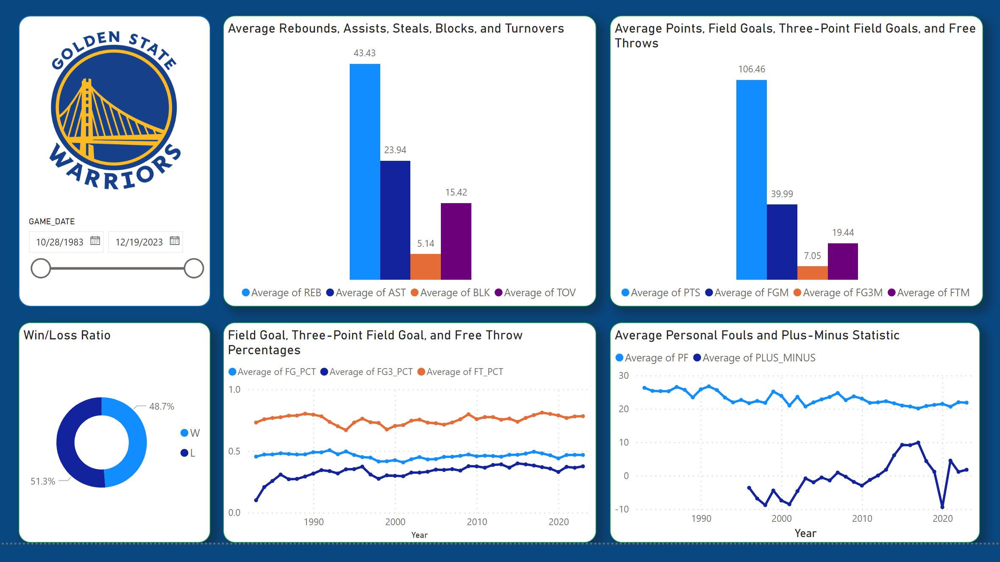

# NBA-Game-Analysis-Golden-State-Warriors

### Project Overview
This lab involves leveraging the NBA API to comprehensively analyze and evaluate the performance of the Golden State Warriors. The primary aim is to ascertain the winning or losing margin of the Golden State Warriors in each game. Additionally, the project includes exporting the obtained data as a csv file for further analysis and visualization in Microsoft Power BI. The key performance metrics to be explored include Winning Percentage, Scoring Efficiency, Defensive Performance, Ball Handling, Rebounding, Assists, Steals, and Blocks.

## Tools Used
1. Python (For API calls)
2. Microsoft Excel (For Data Transformation)
3. Microsoft Power BI (For Data Profiling and Visualization)

## Methodology
1. **ASK**: I need to understand the data before conducting meaningful analysis. So I had to do an extensive study on the NBA game and ask/research every question to fully understand what key metrics was needed for my analysis. 
2. **PREPARE**: After that, I connected to the NBA API using a Python script to get the necessary data.
3. **PROCESS**: Data Transformation was performed in Microsoft Excel. On initial analysis of the data, there were missing values in the following columns:
- FG_PCT: 1 missing value
- FG3A: 1 missing value
- FG3_PCT: 24 missing values
- FT_PCT: 1 missing value
- OREB: 2 missing values
- DREB: 2 missing values
- REB: 1 missing value
- PLUS_MINUS: 1122 missing values

  On further analysis of the data, Using conditional formatting > Highlight cells by rules > Duplicate values, duplicate entries on GAME_ID 1520800001 were found and removed. This also handled the missing data in columns FG_PCT, FT_PCT, and REB.
  
  FG3A: 1 missing value
  The FG3A column, representing attempted three-point field goals, has a connection with the FG3M column, which denotes successful three-point field goals made. In cases where 2 successful three-point field goals were made but the corresponding FG3A value is missing, I opted to fill these missing values by utilizing the median of the FG3A column where the FG3M value is 2. This median value, calculated to be 8, was used to address the missing FG3A values associated with 2 successful three-point shots made. The median is often a better choice than the mean for filling in missing values, as it is less sensitive to outliers and skewed data.
  
  ORED and DREB: 2 missing values:
  The columns OREB (Offensive Rebounds) and DREB (Defensive Rebounds) hold significant importance, particularly in evaluating Rebounding and Defensive Performance. Additionally, the REB (Total Rebounds) column represents the sum of Offensive and Defensive Rebounds. To address missing values, I chose to use the median values of OREB and DREB where the corresponding REB values were 47 and 33, respectively, ensuring a more comprehensive dataset for analysis.
  
  FG3_PCT: 24 missing values
  The FG3_PCT signifies the Three-Point Field Goal Percentage, determined by dividing successful three-point shots made (FG3M) by attempted three-point shots (FG3A). To handle the 24 missing values in FG3_PCT, I computed the FG3M/FG3A ratio. In cases where both FG3M (successful three-point shots made) and FG3A (attempted three-point shots) were registered as 0 in the respective entries with missing FG3_PCT values, I assigned a value of 0 to maintain consistency in the calculation.
  
  Finally, I decided to leave the missing values in PLUS_MINUS columns as they will be dropped during visualization in Microsoft Power BI.

4. **ANALYZE**: Analysis was made using Microsoft Power BI, and the following insights can be deduced from the visualization below.

- The team has won approximately 1776 games and lost the rest.
- On average, they play for about 240 minutes per game.
- They score an average of 106 points per game.
- They make about 40 field goals per game out of an average of 86 attempts, with a field goal percentage of about 46%.
- They make about 7 three-point field goals per game out of an average of 19 attempts, with a three-point field goal percentage of about 33%.
- They make about 19 free throws per game out of an average of 25 attempts, with a free throw percentage of about 75%.
- They get an average of 12 offensive rebounds, 30 defensive rebounds, and 43 total rebounds per game.
- They make an average of 23 assists, 8 steals, 5 blocks, and 15 turnovers per game.
- They commit an average of 22 personal fouls per game.
- The average plus-minus statistic is about 0.48, which means they score about 0.48 points more than their opponents per game on average.

Based on these insights, here are some recommendations:

- Improve three-point shooting: The team's three-point field goal percentage is lower than their overall field goal percentage. Improving their three-point shooting could help them score more points.
- Reduce turnovers: The team averages 15 turnovers per game. Reducing turnovers could help them maintain possession and create more scoring opportunities.
- Improve free throw shooting: The team's free throw percentage is 75%, which is lower than their field goal percentage. Improving their free throw shooting could help them score more points.
- Improve defensive rebounds: The team gets more offensive rebounds than defensive rebounds. Improving their defensive rebounding could help them prevent their opponents from getting second-chance points.

## How to Use

To replicate this analysis or conduct further assessments:

- Run the Code: Execute the provided code that interacts with the NBA API to retrieve game data and analyze the Golden State Warriors' performance.
- Export Data: Utilize the exported dataframe to delve deeper into performance metrics like Winning Percentage, Scoring Efficiency, Defensive Stats, Ball Handling, Rebounding, Assists, Steals, and Blocks using Microsoft Power BI.

## Project Details

- **Data Source**: NBA API
- **Objective**: Analyze Golden State Warriors' game performance to determine winning or losing margins and export data for extensive analysis in Microsoft Power BI.
- **Metrics of Interest**: Winning Percentage, Scoring Efficiency, Defensive Performance, Ball Handling, Rebounding, Assists, Steals, and Blocks.

## Additional Notes

This project streamlines access to NBA game statistics via the API, facilitating in-depth analysis of the Golden State Warriors' performance. The exported dataframe enables further exploration and visualization of various performance metrics in Microsoft Power BI for a comprehensive assessment.
